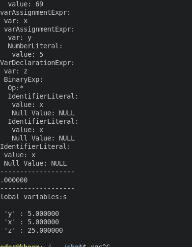

# Skot 
personal project programming lang   
its not useable so dont use it in anything real.  

## How to use
it dosnt do anything about memory once it takes it there is no coming back its not a bug its a feature.    
write ur code in main.skt and 
```
    ./run.sh
```
example of code:   
```
    let a = 1+1+1;
    if(a == 1) {
        a = 420;
        output(a);
    } else if (a == 2) {
        a = 69;
        output(a);
    } 
    else {
        a = 96;
        output(a);
    } 
```


## Sreenshots
